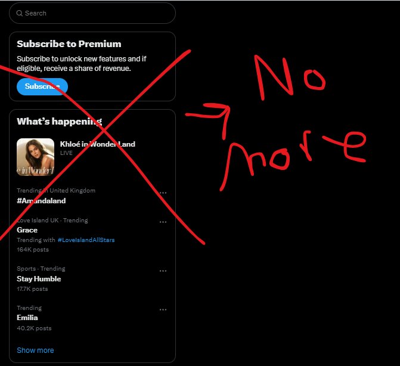

#Twitter/X Cleanup

> **Disclaimer**: I literally made this in 5 minutes using DeepSeek's AI. I don't know web development. Use at your own risk. No updates/support planned.



## 💻 Installation (Chrome)
1. [Download ZIP](https://github.com/OttoSubo/remove-twitter-trends/archive/main.zip)
2. Unzip anywhere
3. Chrome: Go to `chrome://extensions`
4. Toggle **"Developer mode"** ON (top-right)
5. Click **"Load unpacked"**
6. Select the unzipped folder


❗❗ ONLY WORKS FOR LIGHTS OUT MODE NOT DIM MORE LIGHT MODE❗❗


## 🔧 How It Works
This removes:
- "Trending now" sections
- Premium subscription nagging

```javascript
// Basically finds and deletes stuff
document.querySelectorAll('.annoying-class').forEach(el => el.remove());
```

🪪 License - MIT License

This project is licensed under the MIT License. You are free to:

- ✅ Use this code
- ✅ Modify it
- ✅ Distribute it
- ✅ Use it in any project, including commercial applications

No warranties are provided. 


## 🤷 Why Bother?
I just wanted my feed clean and i couldnt find any addons for it so i made (  Ai Made ) this and wanted to share. Made this with:
- 0% Google
- 100% DeepSeek AI
- 0% actual coding skills
